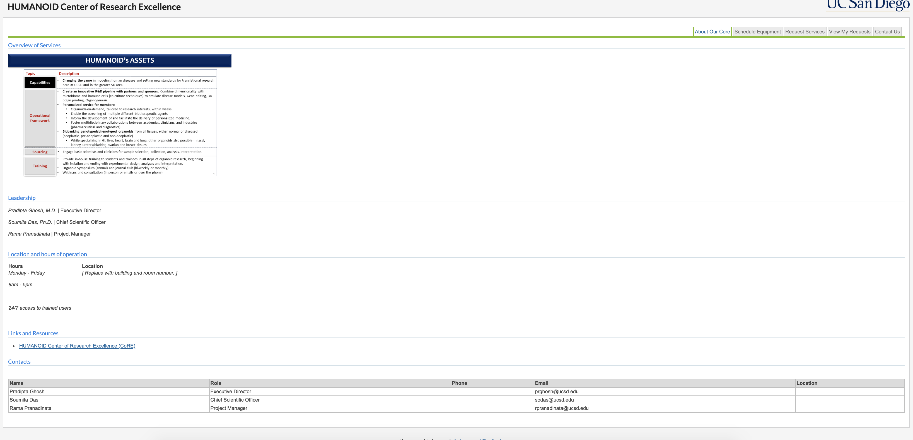
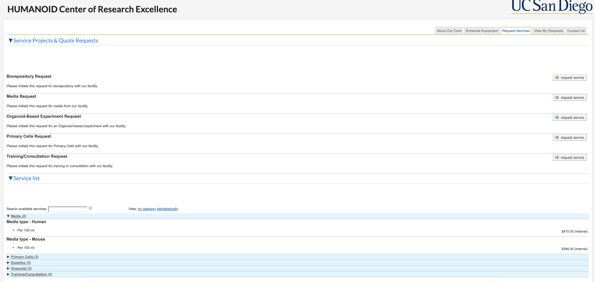
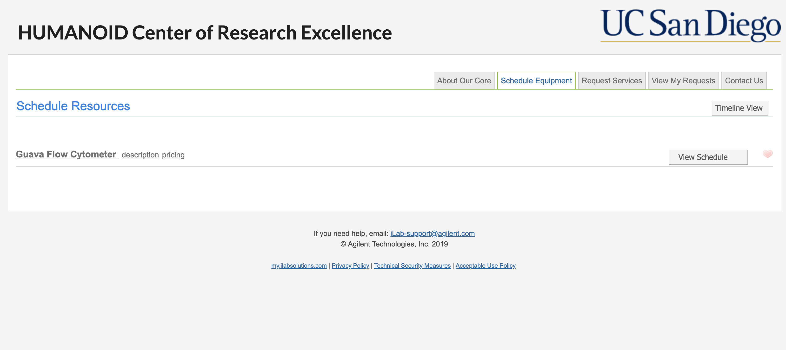
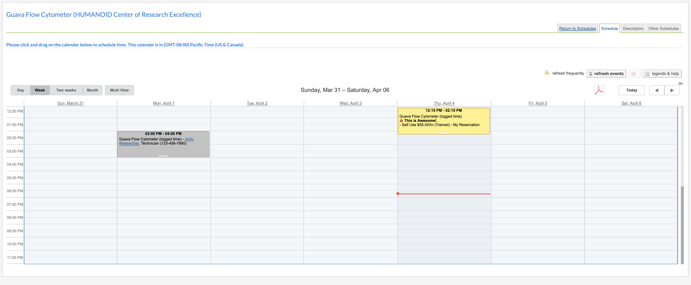

# HUMANOID E-Commerce Site Design

## Overview
This document highlights and provides an overview of the design considerations (UI/UX) when developing HUMANOID's e-commerce website. Front-end and Back-end were developed and monitored by Agilent.

### Landing Page

### Requesting Service

### Scheduleing Equipment

### Scheduleing

## Features
- **Product Catalog**: Display products with details such as name, description, price, and images.
- **User Authentication (handled by Agilent)**: Allow users to register, login, and manage their accounts.
- **Shopping Cart (handled by Agilent)**: Enable users to add products to their cart for purchase.
- **Checkout Process (handled by Agilent)**: Provide a smooth and secure checkout experience with various payment options.
- **Search Functionality**: Implement a search feature to help users find products easily.
- **Responsive Design (handled by Agilent)**: Ensure the website is mobile-friendly for a seamless experience across devices.
- **Order Management**: Allow users to track their orders and view order history.
- **Inventory Management**: Admin interface for managing product inventory and stock levels.
- **Customer Support**: Provide contact information and support channels for customer inquiries and assistance.

## Development Process
1. **Planning**: Define requirements, user stories, and wireframes before starting development.
2. **Development**: Follow an Agile methodology with iterative development and regular testing.
3. **Testing**: Conduct thorough testing including unit tests, integration tests, and user acceptance testing.
5. **Monitoring and Maintenance**: Monitor website performance, security, and user feedback post-launch. Regularly update and maintain the website to address issues and add new features.

## Technologies
- **Partnered with iLab (Agilent) for front-end and back-end**: 

## Design Considerations
- **User Experience (UX)**: Prioritize intuitive navigation, clear product presentation, and a streamlined checkout process.
- **Brand Consistency**: Maintain consistent branding elements throughout the website for a cohesive user experience.
